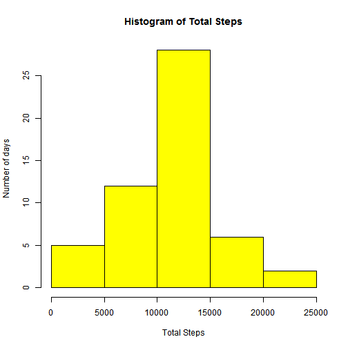
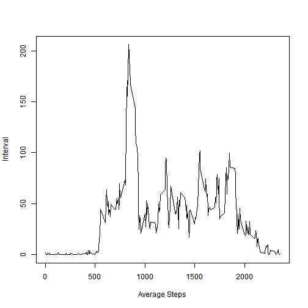
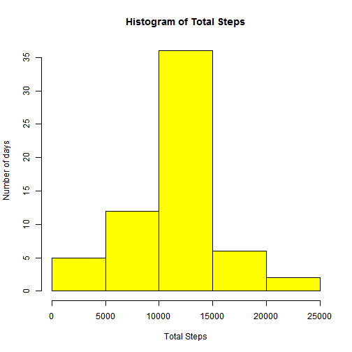
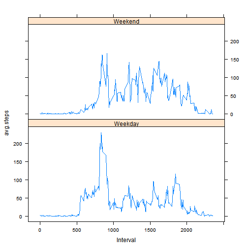

Reproducible Research - Peer Assignment #1 
========================================================

1.Loading and preprocessing the data. 
=====================================
Show any code that is needed to
Load the data (i.e. read.csv())
    

```r
actvty <- read.csv("activity.csv", header = T, na.strings = "NA")
```

Process/transform the data (if necessary) into a format suitable for your analysis

```r
actvty1 <- na.omit(actvty)
```


2.What is mean total number of steps taken per day? 
==================================================
For this part of the assignment, you can ignore the missing values in the dataset.


```r
# Omitting na and missing values
actvty1 <- na.omit(actvty)

# Aggregating steps as per dates:
actvty1_a <- aggregate(actvty1$steps, by = list(actvty1$date), FUN = sum)
colnames(actvty1_a) <- c("date", "total.steps")
```


Make a histogram of the total number of steps taken each day

```r
hist(actvty1_a$total.steps, col = "yellow", main = "Histogram of Total Steps", 
    xlab = "Total Steps", ylab = "Number of days")
```

 

Calculate and report the mean and median total number of steps taken per day

The mean is:

```r
print(mean(actvty1_a$total.steps))
```

```
## [1] 10766
```

The median is:

```r
print(median(actvty1_a$total.steps))
```

```
## [1] 10765
```


3.What is the average daily activity pattern?
============================================
Make a time series plot (i.e. type = "l") of the 5-minute interval (x-axis) and the average number of steps taken, averaged across all days (y-axis)


```r
# Aggregating steps as per interval
actvty1_2 <- aggregate(actvty1$steps, by = list(actvty1$interval), FUN = mean)
colnames(actvty1_2) <- c("interval", "avg.steps")

# Drawing time series plot for average steps during an interval across all
# days:
plot(actvty1_2$interval, actvty1_2$avg.steps, type = "l", xlab = "Average Steps", 
    ylab = "Interval")
```

 


Which 5-minute interval, on average across all the days in the dataset, contains the maximum number of steps?

```r
# Calculating and reporting max interval
print(actvty1_2[which.max(actvty1_2$avg.steps), 1])
```

```
## [1] 835
```


4.Imputing missing values. 
==========================
Note that there are a number of days/intervals where there are missing values (coded as NA). The presence of missing days may introduce bias into some calculations or summaries of the data.

Calculate and report the total number of missing values in the dataset (i.e. the total number of rows with NAs)

The total number of missing values are:

```r
print(nrow(actvty) - nrow(actvty1))
```

```
## [1] 2304
```

Devise a strategy for filling in all of the missing values in the dataset. Create a new dataset that is equal to the original dataset but with the missing data filled in.

Missing values in the original dataset are replaced by the averages for the intervals
-------------------------------------------------------------------------------------

```r
actvty1_2_a <- do.call("rbind", replicate(61, actvty1_2, simplify = FALSE))
actvty1_3 <- cbind(actvty)
suppressWarnings(actvty1_3$steps[is.na(actvty1_3$steps)] <- actvty1_2_a$avg.steps)
```

Make a histogram of the total number of steps taken each day and Calculate and report the mean and median total number of steps taken per day. Do these values differ from the estimates from the first part of the assignment? What is the impact of imputing missing data on the estimates of the total daily number of steps?

```r
# Aggregating steps as per dates
actvty1_3_a <- aggregate(actvty1_3$steps, by = list(actvty1_3$date), FUN = sum)
colnames(actvty1_3_a) <- c("date", "total.steps")

# Creating histogram
hist(actvty1_3_a$total.steps, col = "yellow", main = "Histogram of Total Steps", 
    xlab = "Total Steps", ylab = "Number of days")
```

 

Calculating and reporting mean and median

The mean is:

```r
print(mean(actvty1_3_a$total.steps))
```

```
## [1] 10766
```

The median is:

```r
print(median(actvty1_3_a$total.steps))
```

```
## [1] 10766
```

So, the mean remains the same after replacing the missing values but the median is now higher 
---------------------------------------------------------------------------------------------
and equal to the mean.
---------------------
5.Are there differences in activity patterns between weekdays and weekends?
==========================================================================
For this part the weekdays() function may be of some help here. Use the dataset with the filled-in missing values for this part.
Create a new factor variable in the dataset with two levels – “weekday” and “weekend” indicating whether a given date is a weekday or weekend day.

Introducing weekend variable into the dataframe

```r
wkDayEnd <- data.frame(wkday = weekdays(as.Date(actvty1_3$date)), wkEnd = "")
wkDayEnd$wkEnd <- wkDayEnd$wkday == "Saturday" | wkDayEnd$wkday == "Sunday"

actvty1_4 <- cbind(actvty1_3, wkDayEnd)
```

Make a panel plot containing a time series plot (i.e. type = "l") of the 5-minute interval (x-axis) and the average number of steps taken, averaged across all weekday days or weekend days (y-axis).

```r
# subsetting for weekend and weekdays
actvty1_4_wdy <- subset(actvty1_4, wkEnd == F)
actvty1_4_wnd <- subset(actvty1_4, wkEnd == T)

# Aggregating steps as per dates
actvty1_4_wdy_a <- aggregate(actvty1_4_wdy$steps, by = list(actvty1_4_wdy$interval), 
    FUN = mean)
actvty1_4_wnd_a <- aggregate(actvty1_4_wnd$steps, by = list(actvty1_4_wnd$interval), 
    FUN = mean)
colnames(actvty1_4_wdy_a) <- c("Interval", "avg.steps")
colnames(actvty1_4_wnd_a) <- c("Interval", "avg.steps")

# adding weekday/weekend to aggregated data
actvty1_4_wdy_aa <- cbind(actvty1_4_wdy_a, wknd = "Weekday")
actvty1_4_wnd_aa <- cbind(actvty1_4_wnd_a, wknd = "Weekend")

# combining aggregated data frames
actvty1_4_wdywnd <- rbind(actvty1_4_wdy_aa, actvty1_4_wnd_aa)

# drawing plot
library(lattice)

d <- xyplot(avg.steps ~ Interval | wknd, data = actvty1_4_wdywnd, type = "l", 
    layout = c(1, 2))
print(d)
```

 


